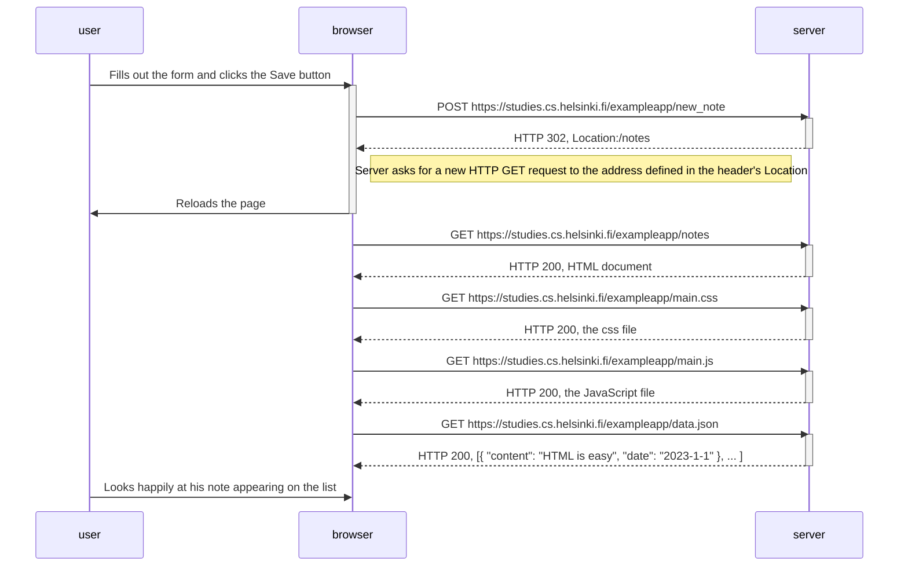

```mermaid
sequenceDiagram
    participant user
    participant browser
    participant server

    user->>browser : Fills out the form and clicks the Save button
    activate browser

    browser->>server: POST https://studies.cs.helsinki.fi/exampleapp/new_note
    activate server
    server-->>browser: HTTP 302, Location:/notes
    deactivate server
 
    note right of browser: Server asks for a new HTTP GET request to the address defined in the header's Location 

    browser->>user: Reloads the page
    deactivate browser

    browser->>server: GET https://studies.cs.helsinki.fi/exampleapp/notes
    activate server
    server-->>browser: HTTP 200, HTML document
    deactivate server

    browser->>server: GET https://studies.cs.helsinki.fi/exampleapp/main.css
    activate server
    server-->>browser: HTTP 200, the css file
    deactivate server

    browser->>server: GET https://studies.cs.helsinki.fi/exampleapp/main.js
    activate server
    server-->>browser: HTTP 200, the JavaScript file
    deactivate server

    browser->>server: GET https://studies.cs.helsinki.fi/exampleapp/data.json
    activate server
    server-->>browser: HTTP 200, [{ "content": "HTML is easy", "date": "2023-1-1" }, ... ]
    deactivate server

    user->>browser: Looks happily at his note appearing on the list
```
